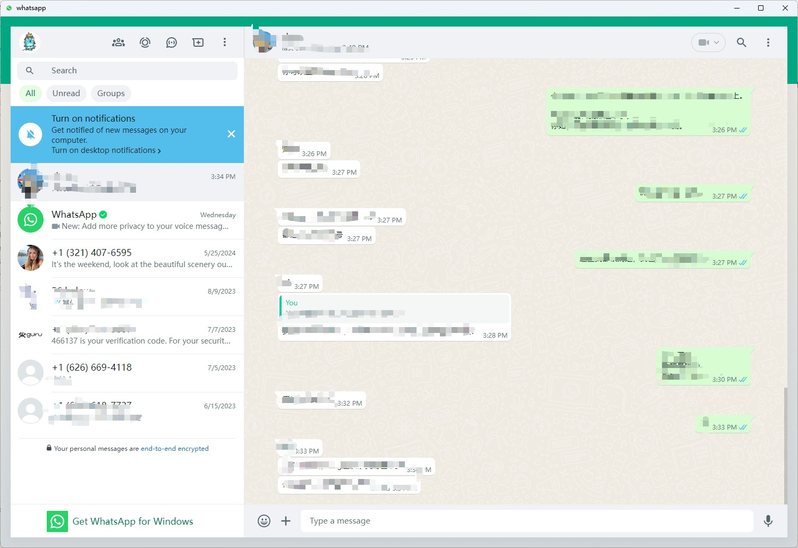

# Whatsapp Deskstop

This project is a desktop email client built with Rust and Tauri that loads [Whatsapp](https://web.whatsapp.com/) in a lightweight, standalone application. The goal is to provide a seamless and efficient user experience for accessing Whatsapp without relying on a web browser.

## Features

- **Lightweight:** Minimal resource usage compared to traditional web browsers.
- **Cross-Platform:** Runs on Windows, macOS, and Linux.
- **Secure:** Utilizes Tauri's secure context to load Whatsapp.
- **Customizable:** Easily customize the client for your specific needs.
## show

## Getting Started

### Prerequisites

Ensure you have the following installed on your system:

- [Rust](https://www.rust-lang.org/)
- [Node.js](https://nodejs.org/)
- [Tauri CLI](https://tauri.app/v1/guides/getting-started/prerequisites)

### Installation

1. Clone the repository:

   ```bash
   git clone https://github.com/llitongjava/whatsapp-desktop.git
   cd whatsapp-desktop
   ```

2. Build the project:

   ```bash
   cargo tauri build
   ```


## Usage

- Open the application and log in to your Whatsapp account.
- Enjoy a distraction-free Whatsapp experience directly from your desktop.


## Contributing

Contributions are welcome! Please open an issue or submit a pull request.

## License

This project is licensed under the MIT License - see the [LICENSE](LICENSE) file for details.

## Acknowledgements

- [Tauri](https://tauri.app/)
- [Rust](https://www.rust-lang.org/)
- [Whatsapp](https://mail.google.com)

